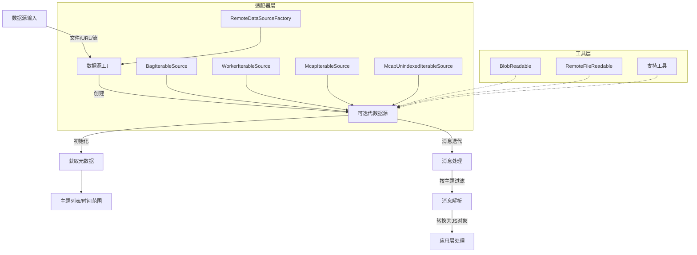
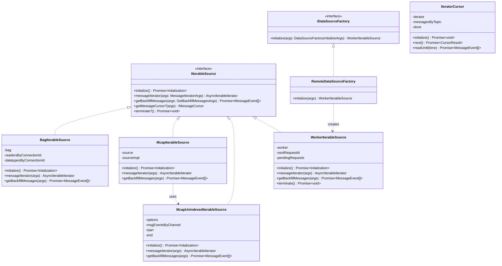

# RosBag Engine 模块

## 简介

RosBag Engine 是一个用于处理和解析 ROS（机器人操作系统）bag 文件和 MCAP 文件的模块。它提供了一套完整的工具和接口，用于读取、解析和处理 ROS bag 和 MCAP 文件中的数据，支持在浏览器环境中工作。该模块主要用于可视化平台中，使用户能够加载、播放和分析 ROS bag 和 MCAP 数据。

## 架构图

### 数据流程图



### 类图



## 核心功能

### 1. 数据源处理

- 支持多种数据源输入：文件（File/Blob）、URL（远程文件）、流（Stream）
- 提供统一的数据源工厂接口（IDataSourceFactory）用于创建和初始化数据源
- 支持远程数据源的创建和管理

### 2. 消息迭代与解析

- 提供消息迭代器接口，用于按顺序或逆序遍历 bag/mcap 文件中的消息
- 支持按主题（topic）过滤消息
- 支持时间范围过滤，可指定开始和结束时间
- 提供消息解析功能，将二进制数据转换为可用的 JavaScript 对象

### 3. 文件处理与下载

- 提供远程文件读取功能（RemoteFileReadable）用于从远程服务器获取文件
- 实现 Blob 读取功能（BlobReadable），处理本地文件
- 支持大文件的分块读取和处理

### 4. 适配器层

- BagIterableSource：实现了 IIterableSource 接口，用于处理 ROS bag 文件
- McapIterableSource：实现了 IIterableSource 接口，用于处理 MCAP 文件
- McapUnindexedIterableSource：处理无索引的 MCAP 文件
- WorkerIterableSource：在 Web Worker 中运行的可迭代数据源，提高性能并避免阻塞主线程
- RemoteDataSourceFactory：用于创建远程数据源的工厂类
- IteratorCursor：提供更灵活的消息读取方式，支持批量读取和精确控制

### 5. 工具类

- 提供各种工具类和辅助函数，如内存估算、压缩/解压缩处理等
- 实现了远程文件读取机制，优化数据访问性能

## 目录结构

```
rosbag-engine/
├── BagIterableSource.ts            # ROS bag 可迭代数据源实现
├── BagIterableSourceWorker.worker.ts # Bag Worker 实现
├── BlobReadable.ts                 # Blob 读取实现
├── IDataSourceFactory.ts           # 数据源工厂接口定义
├── IteratorCursor.ts               # 迭代器游标实现
├── McapIterableSource.ts           # MCAP 可迭代数据源实现
├── McapIterableSourceWorker.worker.ts # MCAP Worker 实现
├── McapUnindexedIterableSource.ts  # 无索引 MCAP 数据源实现
├── RemoteDataSourceFactory.ts      # 远程数据源工厂实现
├── WorkerIterableSource.ts         # Web Worker 可迭代数据源
├── WorkerIterableSourceWorker.ts   # Worker 实现
├── downloader.ts                   # 下载相关功能导出
├── index.ts                        # 模块入口和导出
├── messageMemoryEstimation.ts      # 消息内存估算工具
├── support/                        # 支持工具和辅助函数
│   ├── loadDecompressHandlers.ts   # 解压处理器加载
│   ├── parseChannel.ts             # 通道解析
│   └── ...
├── types.ts                        # 类型定义
└── util/                           # 工具类和辅助函数
    ├── RemoteFileReadable.ts       # 远程文件读取实现
    └── ...
```

## 使用示例

### 使用 ROS Bag 文件

```typescript
import { RemoteDataSourceFactory } from './rosbag-engine'

// 创建数据源工厂
const factory = new RemoteDataSourceFactory()

// 初始化数据源（ROS Bag 文件）
const source = factory.initialize({ params: { url: 'https://example.com/sample.bag' } })

// 获取 bag 文件元信息
const bagMetaInfo = await source.initialize()

// 获取可用的主题列表
const availableTopics = bagMetaInfo.topics.map(topic => topic.name)

// 创建消息迭代器
const topics = new Map(selectedTopics.map(topic => [topic, { topic }]))
const messageIterator = source.messageIterator({ topics })

// 迭代处理消息
for await (const result of messageIterator) {
  if (result.type === 'message-event') {
    const message = result.msgEvent.message
    // 处理消息...
  }
}
```

### 使用 MCAP 文件

```typescript
import { McapIterableSource } from './rosbag-engine'

// 创建 MCAP 数据源（本地文件）
const fileSource = new McapIterableSource({
  type: 'file',
  file: fileBlob // 从文件输入或拖放获取的 Blob
})

// 或者使用远程 URL
const urlSource = new McapIterableSource({
  type: 'url',
  url: 'https://example.com/sample.mcap'
})

// 初始化数据源
const mcapMetaInfo = await fileSource.initialize()

// 获取可用的主题列表
const availableTopics = mcapMetaInfo.topics.map(topic => topic.name)

// 创建消息迭代器
const topics = new Map(selectedTopics.map(topic => [topic, { topic }]))
const messageIterator = fileSource.messageIterator({ topics })

// 迭代处理消息
for await (const result of messageIterator) {
  if (result.type === 'message-event') {
    const message = result.msgEvent.message
    // 处理消息...
  }
}
```

## 已实现功能

- [x] ROS Bag 格式支持
- [x] MCAP 格式支持
  - [x] 无索引 MCAP 文件支持
  - [x] 压缩格式 zstd 支持
## 待办功能事项

- [ ] 完善 MCAP 格式支持
  - [ ] 有索引 MCAP 文件支持
  - [ ] 压缩格式 bz2 支持 🔥
  - [ ] 压缩格式 lz4 支持

- [ ] 实现流式数据源（Stream）的完整支持
- [ ] 优化大型文件的内存使用
- [ ] 添加对更多 ROS 消息类型的支持
